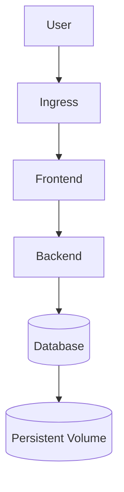

# 🚀 Déploiement d’une Application Web avec Base de Données sur Kubernetes

---

## 📖 Overview

Ce projet met en œuvre le déploiement complet d’une application web conteneurisée avec base de données sur un cluster Kubernetes en suivant les bonnes pratiques **Cloud Native** et **DevOps**.

### 🎯 Objectifs du projet

- Déployer une application scalable sur Kubernetes  
- Connecter une base de données persistante  
- Mettre en place une architecture proche production  
- Automatiser et sécuriser le déploiement  
- Expérimenter l’orchestration et la haute disponibilité  

---

# 🏗 Architecture



---

# ⚙️ Stack Technique

| Technologie | Rôle |
|-----------|------|
| Kubernetes | Orchestration |
| Docker | Conteneurisation |
| Ingress | Routage HTTP |
| ConfigMaps | Configuration |
| Secrets | Gestion des credentials |
| Persistent Volumes | Stockage persistant |

---

# 📂 Structure du Projet

```bash
.
├── app/
│ ├── frontend/
│ └── backend/
│
├── k8s/
│ ├── deployment.yaml
│ ├── service.yaml
│ ├── ingress.yaml
│ ├── configmap.yaml
│ ├── secret.yaml
│ └── database/
│    ├── statefulset.yaml
│    └── pvc.yaml
│
└── README.md
```

---

# 🚀 Déploiement

## Cloner le projet

```bash
git clone https://github.com/username/repo.git
cd repo
```

## Déployer l’infrastructure

```bash
kubectl apply -f k8s/
```

## Vérifier les ressources

```bash
kubectl get pods
kubectl get services
kubectl get ingress
```

---

# 🔥 Fonctionnalités mises en œuvre

✔ Multi-Pods Deployment  
✔ Stateful Database  
✔ Persistent Storage  
✔ Secrets & ConfigMaps  
✔ Ingress Routing  
✔ Rolling Updates  
✔ Horizontal Scaling  
✔ Haute Disponibilité

---

# 📈 Scaling

```bash
kubectl scale deployment web-app --replicas=3
```

Kubernetes distribue automatiquement la charge entre plusieurs instances.

---

# 🔐 Sécurité

- Isolation des services  
- Variables sensibles via Secrets  
- Persistance sécurisée des données  
- Architecture découplée frontend / backend / database

---

# 📸 Aperçu

## Application déployée


## Cluster Kubernetes


*(Ajouter tes screenshots ici)*

---

# 🧠 Compétences démontrées

Ce projet met en avant :

- Kubernetes Administration  
- Containerization  
- DevOps Engineering  
- Infrastructure as Code  
- Cloud Native Architecture  
- Networking & Storage  
- Scalability Concepts

---

# 🔮 Améliorations futures

- CI/CD avec GitHub Actions  
- Helm Charts  
- Monitoring Prometheus + Grafana  
- Auto-scaling (HPA)  
- Déploiement cloud (AWS / GCP / Azure)

---

## 📊 Commandes utiles

```bash
# Voir les pods
kubectl get pods

# Logs application
kubectl logs <pod-name>

# Accès shell pod
kubectl exec -it <pod-name> -- bash
```

---

# 👨‍💻 Auteur

**Ton Nom**  
Projet DevOps / Kubernetes Portfolio

---

## ⭐ Support

Si le projet te plaît :

```bash
Fork 🍴
Star ⭐
Contribute 🚀
```

